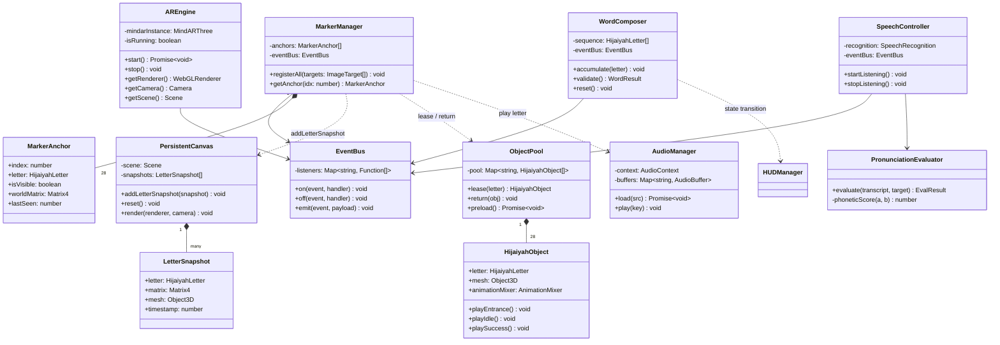

# WebAR Hijaiyah — Complete Project Architecture

> **Stack**: Three.js · MindAR · TypeScript · Vite
> **Constraint**: No Unity · Mobile-first (Android Chrome) · Production-ready

---

## 1. Folder Structure

```
ar-hijaiyah/
│
├── app/
│   ├── core/
│   │   ├── AREngine.ts           # MindAR init, camera, scene lifecycle
│   │   ├── Renderer.ts           # Three.js WebGLRenderer wrapper
│   │   ├── SceneManager.ts       # Scene, Camera, Lights
│   │   └── EventBus.ts           # Typed pub/sub event system
│   │
│   ├── tracking/
│   │   ├── MarkerManager.ts      # Register/unregister MindAR anchors
│   │   ├── MarkerAnchor.ts       # Single anchor state model
│   │   └── TrackingEvents.ts     # Typed event definitions
│   │
│   ├── persistence/              # Core research contribution
│   │   ├── PersistentCanvas.ts   # Secondary scene — letters never removed
│   │   ├── LetterSnapshot.ts     # Frozen world-transform record
│   │   └── WordComposer.ts       # Assembles snapshots into a word
│   │
│   ├── objects/
│   │   ├── HijaiyahObject.ts     # Mesh + animation state
│   │   ├── ObjectPool.ts         # Pre-allocate 28 meshes, lease/return
│   │   └── AnimationController.ts
│   │
│   ├── ui/
│   │   ├── HUDManager.ts
│   │   ├── WordStrip.ts          # Live right-to-left letter display
│   │   └── FeedbackOverlay.ts    # Green/red flash + haptics
│   │
│   ├── audio/
│   │   ├── AudioManager.ts       # Web Audio API context & buffer pool
│   │   └── PronunciationPlayer.ts
│   │
│   ├── speech/                   # Future module
│   │   ├── SpeechController.ts   # Adapter: Web Speech API / Whisper.wasm
│   │   ├── PronunciationEvaluator.ts
│   │   └── SpeechEvents.ts
│   │
│   ├── data/
│   │   ├── hijaiyah.data.ts      # 28 letters registry + metadata
│   │   ├── words.data.ts         # Target word list for validation
│   │   └── types.ts              # Shared TypeScript interfaces
│   │
│   ├── utils/
│   │   ├── math.utils.ts
│   │   ├── device.utils.ts       # DPR, orientation, UA detection
│   │   └── logger.ts
│   │
│   └── main.ts                   # Entry point
│
├── assets/
│   ├── markers/hijaiyah.mind     # All 28 markers compiled into one file
│   ├── models/[alif-ya].glb
│   └── audio/[alif-ya].mp3
│
├── public/index.html
├── vite.config.ts
├── tsconfig.json
└── package.json
```

---

## 2. Module Responsibilities

| Module | Layer | Responsibility |
|---|---|---|
| `AREngine` | Core | Boot MindAR, bind camera stream, manage lifecycle |
| `Renderer` | Core | Own `WebGLRenderer`, handle resize & DPR |
| `SceneManager` | Core | Own `Scene`, `PerspectiveCamera`, lights |
| `EventBus` | Core | Decouple modules via typed pub/subscribe |
| `MarkerManager` | Tracking | Register 28 anchors, emit `marker:found/lost` |
| `MarkerAnchor` | Tracking | Hold per-marker state (visible, matrix, lastSeen) |
| `PersistentCanvas` | Persistence | Secondary scene; never remove placed letters |
| `LetterSnapshot` | Persistence | Immutable world-space transform record |
| `WordComposer` | Persistence | Sequence accumulation + word validation |
| `HijaiyahObject` | Objects | GLTF mesh + entrance/idle/success animations |
| `ObjectPool` | Objects | Pre-allocate all 28 meshes; zero runtime GC |
| `AnimationController` | Objects | Drive GSAP/Three.js animation states |
| `HUDManager` | UI | State machine: idle / tracking / word-complete |
| `WordStrip` | UI | Reactive DOM word display (RTL) |
| `FeedbackOverlay` | UI | Flash overlay + `navigator.vibrate()` |
| `AudioManager` | Audio | Web Audio API context, buffer decode & pool |
| `PronunciationPlayer` | Audio | Play letter/word `.mp3` on events |
| `SpeechController` | Speech | Adapter over Web Speech API / Whisper.wasm |
| `PronunciationEvaluator` | Speech | Phonetic score → `speech:pass/fail` |

---

## 3. Data Flow

### Marker Detection → Persistent Render

```
Camera Stream
    │
    ▼
[AREngine] tick()
    │
    ▼
[MarkerManager] onTargetFound(idx)
    │
    ▼
[EventBus] emit("marker:found", { idx, letter })
    │
    ├──► [ObjectPool] lease mesh → show in live AR scene
    ├──► [PersistentCanvas] addLetterSnapshot(worldMatrix)
    └──► [PronunciationPlayer] play(letter.mp3)
                │
                ▼
         [WordComposer] accumulate(letter)
                │
         if word complete
                │
                ▼
         [EventBus] emit("word:composed", word)
                │
         ├──► [WordStrip] update DOM
         ├──► [FeedbackOverlay] flash green
         └──► [PronunciationPlayer] play(word.mp3)
```

### Persistence Mechanism (autoClear=false)

```
Render loop tick:
  1. renderer.clear()
  2. render(liveScene, camera)      ← active AR anchors
  3. render(persistentScene, camera) ← frozen letter snapshots
     autoClear = false on step 3 → composites over live scene
```

### Future Speech Flow

```
[SpeechController] listen()
    ▼
transcript: "جيم"
    ▼
[PronunciationEvaluator] phoneticScore(transcript, target)
    ├── ≥ threshold → emit("speech:pass") → FeedbackOverlay green
    └── < threshold → emit("speech:fail") → FeedbackOverlay red + retry
```

---

## 4. Class Diagram



---

## 5. Development Roadmap

### Phase 1 — Foundation (Week 1–2)
**Goal**: Camera renders in browser; one marker shows one 3D letter.

| Task | Output |
|---|---|
| Vite + TypeScript scaffold | `vite.config.ts`, `tsconfig.json` |
| MindAR + Three.js integration | `AREngine`, `Renderer`, `SceneManager` |
| Single marker PoC | One `.mind` + one `.glb` on marker |
| EventBus skeleton | Typed pub/sub working |
| Mobile baseline test | 60fps on Android Chrome validated |

> **Decision**: Use `MindARThree` helper — reduces camera/renderer wiring boilerplate.

---

### Phase 2 — Multi-Marker Tracking (Week 3–4)
**Goal**: All 28 markers recognized independently.

| Task | Output |
|---|---|
| Compile all 28 markers → `hijaiyah.mind` | Single bundle (reduces HTTP requests) |
| `MarkerManager` registers 28 anchors | `marker:found/lost` firing |
| `ObjectPool` preloads 28 GLBs | Zero runtime load spikes |
| Letter audio on detection | `AudioManager` + `PronunciationPlayer` |
| Basic HUD | Letter name displayed |

> **Decision**: Single `.mind` is mandatory. Multi-file loading causes desync on mobile.

---

### Phase 3 — Persistent Rendering (Week 5–6)
**Goal**: Detected letters remain visible after marker leaves camera.

| Task | Output |
|---|---|
| `PersistentCanvas` secondary scene | Letters never removed after detection |
| `autoClear=false` dual-render pipeline | Live + persistent composited |
| World-space snapshot on detection | `LetterSnapshot` captures `matrixWorld` |
| `WordComposer` sequence state | Letter order tracked |
| Reset gesture (shake / button) | `PersistentCanvas.reset()` |

> **Risk**: Two render passes on mobile GPU. Mitigation: `MeshBasicMaterial` for persistent letters, no shadows on persistent scene.

---

### Phase 4 — Word Composition & Validation (Week 7–8)
**Goal**: Children build valid words, receive audio/visual feedback.

| Task | Output |
|---|---|
| `words.data.ts` — ~50 target words | Curated children's vocabulary |
| `WordComposer.validate()` | Real-time match |
| `WordStrip` RTL DOM component | Live letter display |
| `FeedbackOverlay` success/fail | Green burst / red shake |
| Word audio on success | Full word `.mp3` |
| Session score counter | In-memory, displayed in HUD |

---

### Phase 5 — Polish & Research Instrumentation (Week 9–10)

| Task | Output |
|---|---|
| Lighthouse mobile audit | 60fps sustained, CLS < 0.1 |
| Touch targets ≥ 48×48px | WCAG 2.1 AA compliant |
| `SessionLogger.ts` | Timestamped JSON event log |
| Onboarding tutorial overlay | First-use flow |
| PWA manifest + service worker | Offline, installable |
| Research participant mode | Anonymized session IDs + export |

---

### Phase 6 — Speech Recognition *(Future)*

| Task | Output |
|---|---|
| `SpeechController` Web Speech API adapter | Android Chrome ASR |
| `PronunciationEvaluator` phonetic scoring | Levenshtein + Arabic phoneme map |
| Whisper.wasm fallback | Offline ASR |
| Grading rubric | Score 0–100, configurable threshold |
| Research data capture | Attempt log per participant |

> **Decision**: `SpeechController` is an adapter interface — Whisper.wasm can replace Web Speech API without touching business logic.

---

## Critical Design Decisions

| Decision | Rationale |
|---|---|
| `autoClear=false` dual-scene render | Only correct WebGL strategy for persistent AR overlay |
| Capture `matrixWorld` not anchor-relative position | Anchor position is camera-relative and will drift when camera moves |
| Single `.mind` file for all 28 markers | MindAR multi-file loading causes target desync on mobile |
| `ObjectPool` pre-allocation | Prevents runtime GC spikes on mid-range Android |
| `EventBus` decoupling | Enables isolated unit testing of each module |
| `SpeechController` as adapter | Allows Web Speech API ↔ Whisper.wasm swap at any phase |